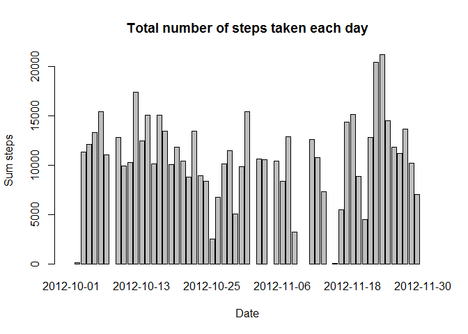
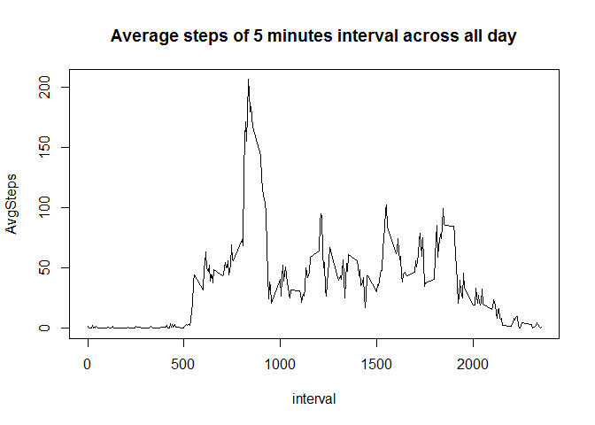
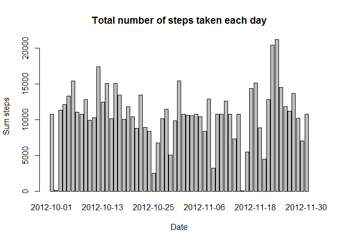
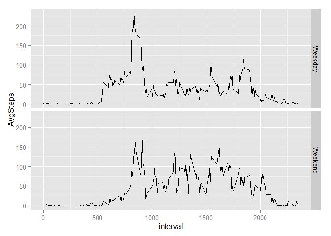

# Reproducible Research: Peer Assessment 1


## Loading and preprocessing the data

```r
library(dplyr)
```

```
## 
## Attaching package: 'dplyr'
## 
## The following object is masked from 'package:stats':
## 
##     filter
## 
## The following objects are masked from 'package:base':
## 
##     intersect, setdiff, setequal, union
```

```r
library(ggplot2)
data <- read.csv("./activity.csv", header=TRUE,sep=",")
```
Dataset contains total number of steps taken each day

```r
perday <- data %>% group_by(date) %>% summarise(sum_steps=sum(steps))
```


## What is mean total number of steps taken per day?

Make a histogram of the total number of steps taken each day


```r
with(perday, barplot(height=sum_steps,names.arg=date,xlab="Date",ylab="Sum steps",main="Total number of steps taken each day"))
```

 


Calculate and report the mean and median total number of steps taken per day

```r
mean(perday$sum_steps,na.rm=TRUE)
```

```
## [1] 10766.19
```

```r
median(perday$sum_steps,na.rm=TRUE)
```

```
## [1] 10765
```

## What is the average daily activity pattern?

Make a time series plot (i.e. type = "l") of the 5-minute interval (x-axis) and the average number of steps taken, averaged across all days (y-axis)


```r
avg <-data %>% group_by(interval) %>% summarise(AvgSteps=mean(steps,na.rm=TRUE))
with(avg, plot(interval,AvgSteps, type="l",main="Average steps of 5 minutes interval across all day" ))
```

 

Which 5-minute interval, on average across all the days in the dataset, contains the maximum number of steps?

```r
avg[avg$AvgSteps==max(avg$AvgSteps),]
```

```
## Source: local data frame [1 x 2]
## 
##   interval AvgSteps
## 1      835 206.1698
```

## Imputing missing values

Calculate and report the total number of missing values in the dataset. 


```r
nrow(data[is.na(data$steps),])
```

```
## [1] 2304
```
Filling in all of the missing values in the dataset by the mean for that 5-minute interval.

```r
newdata <- data
for(row in 1:nrow(newdata)){
  if (is.na(newdata$steps[row])) {
    newdata$steps[row]<- avg$AvgSteps[avg$interval==newdata[row,]$interval]
  }
}
```
New Dataset contains total number of steps taken each day

```r
newperday <- newdata %>% group_by(date) %>% summarise(sum_steps=sum(steps))
```
Make a histogram of the total number of steps taken each day of new dataset


```r
with(newperday, barplot(height=sum_steps,names.arg=date,xlab="Date",ylab="Sum steps",main="Total number of steps taken each day"))
```

 

Calculate and report the mean and median total number of steps taken per day on new dataset

```r
mean(newperday$sum_steps)
```

```
## [1] 10766.19
```

```r
median(newperday$sum_steps)
```

```
## [1] 10766.19
```
Now the new mean and the new median are same with the mean of orginal dataset.Imputing missing data on the estimates base on above strategy makes dataset is distributed  more uniformly (mean is same median).

## Are there differences in activity patterns between weekdays and weekends?

Create a new factor variable in the dataset with two levels -- "weekday" and "weekend" indicating whether a given date is a weekday or weekend day.

```r
newdata$day <- weekdays(as.Date(newdata$date))
for(row in 1:nrow(newdata)){
  if (newdata[row,]$day %in% c("Saturday", "Sunday")) {
    newdata[row,]$day<- "Weekend"
  }
  else {newdata[row,]$day <-"Weekday"}
}
```

Make a panel plot containing a time series plot (i.e. type = "l") of the 5-minute interval (x-axis) and the average number of steps taken, averaged across all weekday days or weekend days (y-axis)


```r
newavg <-newdata %>% group_by(day,interval) %>% summarise(AvgSteps=mean(steps,na.rm=TRUE))
qplot(interval, AvgSteps,data=newavg,facets=day~.,geom="line",binwidth=2)
```

 

